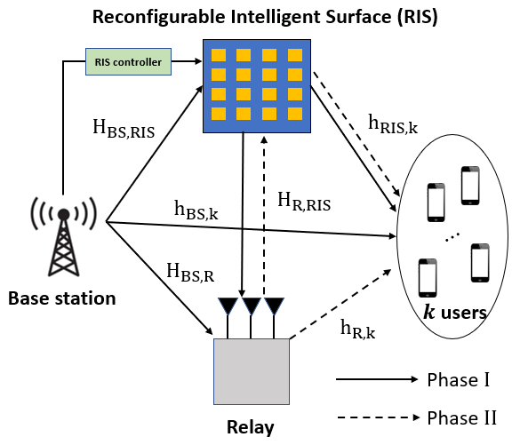
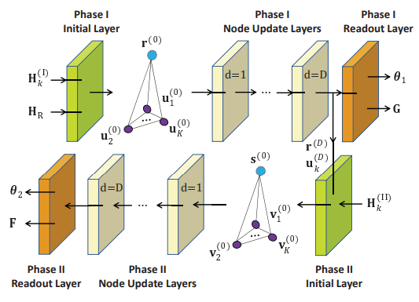
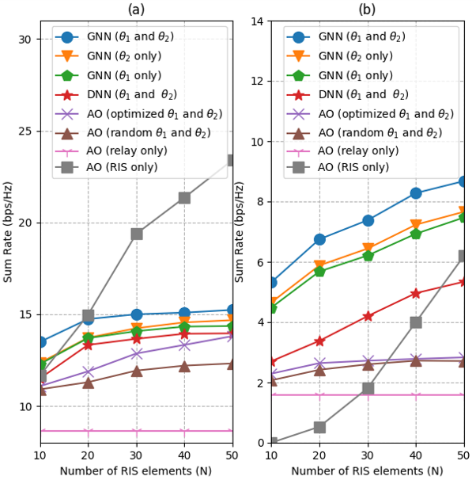

#  Graph Neural Network-Based Joint Beamforming for Hybrid Relay and Reconfigurable Intelligent Surface Aided Multiuser Systems

## Introduction:
This study examines a downlink multiple-input single-output (MISO) system, where a base station (BS) with
multiple antennas sends data to multiple single-antenna users with the help of a reconfigurable intelligent surface (RIS) and a half-duplex decode-and-forward (DF) relay. The system’s sum rate is maximized through joint optimization of active beamforming at the BS and DF relay and passive beamforming at the RIS by graph neural network (GNN)

This code is for paper : 
Graph Neural Network-Based Joint Beamforming for Hybrid Relay and Reconfigurable Intelligent Surface Aided Multiuser Systems

## Conception:
### system setup

### model structure

## Execution:
Open trainer.py in GNN or DNN folder and the parameters of schematic are defined in the main function of trainer.py.
### batch_size
Batch size for training
### sigma
The channel variation coefficient for imperfect CSI effect
### training_K
Number of users while training
### testing_K
Number of users while testing
### M
Number of antennas for the BS
### N
Number of RIS elements
### L
Number of antennas for the relay

Run trainer.py and start to simulate with the designed scheme.
`python trainer.py`

## Experiement Result:

## Dependencies:

- python==3.9.7
- torch==1.9.0+cu102
- numpy==1.21.1
- sklearn==0.24.2

## Contact:
Bing-Jia Chen, r11942023@ntu.edu.tw
